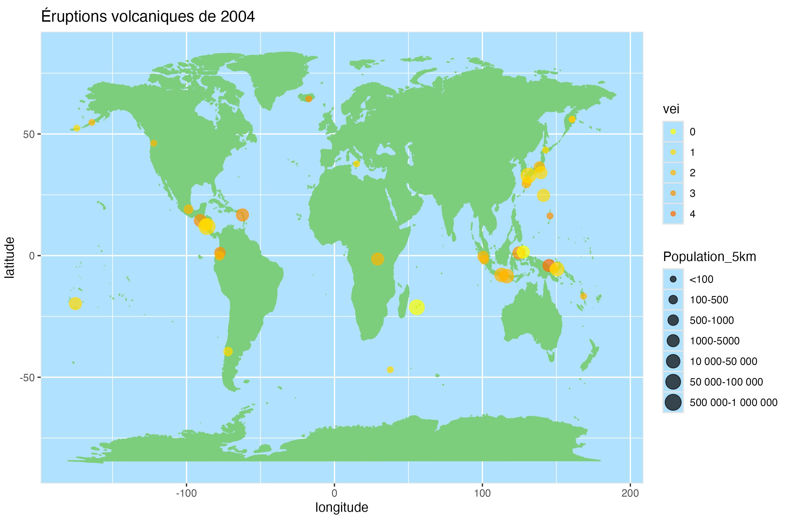

```{r load-packages, include = FALSE}
# Ajoutez tous les packages supplémentaires dont vous avez besoin à ce chunk
install.packages("xaringanthemer", repos = "http://cran.us.r-project.org", dependencies = TRUE)
#install.packages("gganimate")
#install.packages("xaringanthemer", repos = "http://cran.us.r-project.org") - J'ai juste eu besoin de faire rouler ça une première fois, on peut retirer la ligne quand ça fonctionne pour toutes.
library(tidyverse)
library(palmerpenguins)
library(knitr)
library(xaringanthemer)
library(kableExtra)
library(readr)
library(ggplot2)
library(gganimate)
library(ggmap)
library(leaflet)

```

```{r setup, include=FALSE}
# Pour une meilleure résolution de figure
knitr::opts_chunk$set(fig.retina = 3, dpi = 300, fig.width = 6, fig.asp = 0.618, out.width = "80%", warning = FALSE, message = FALSE)
style_xaringan(
  title_slide_background_image = "img/volcan.png"
)
```

```{r load-data, include=FALSE}
# Charger vos données ici

#Chargement des tableaux
eruptions <- read_csv("../data/eruptions.csv")
events <- read_csv("../data/events.csv")
volcano <- read_csv("../data/volcano.csv")
#Création du jeu de donnée
volcan1<-merge(eruptions,events, by="eruption_number") #Jeu intermédiaire pour 1er merge
volcan<-merge(volcan1,volcano, by.x="volcano_number.x", by.y="volcano_number")
volcan<-volcan[, -c(8,9,12,13,16,17,18,21,23,24,25,31,32,37:40,42:45)]
colnames(volcan)[1] <- "volcano_number"
colnames(volcan)[3] <- "volcano_name"
colnames(volcan)[10] <- "latitude"
colnames(volcan)[11] <- "longitude"
volcan$last_eruption_year<-as.numeric(volcan$last_eruption_year)
volcan$minor_rock_1<-ifelse(volcan$minor_rock_1== unique(volcan$minor_rock_1)[3],NA,volcan$minor_rock_1)
remove(volcan1)#retarit du jeu intermédiaire

volcan_resume<-volcan[,c(3,15,20,16,25,17,18,19,5,7,9,4,6,8,13,14)]

#Animation:
geoanim<-data.frame(long=volcan$longitude,
                    lati=volcan$latitude, 
                    vei=volcan$vei,
                    pop=volcan$population_within_5_km,
                    annee=as.character(volcan$start_year))

geoanim<-unique(geoanim)
geoanim$annee<-as.integer(geoanim$annee)

geoanim$Population_5km<-ifelse(geoanim$pop<100,"<100",
                          ifelse(geoanim$pop>=100&geoanim$pop<=500, "100-500",
                            ifelse(geoanim$pop>500&geoanim$pop<=1000, "500-1000",
                              ifelse(geoanim$pop>1000&geoanim$pop<=5000, "1000-5000",
                                ifelse(geoanim$pop>5000&geoanim$pop<=10000, "5000-10 000",
                                  ifelse(geoanim$pop>10000&geoanim$pop<=50000, "10 000-50 000",
                                    ifelse(geoanim$pop>50000&geoanim$pop<=100000, "50 000-100 000",
                                      ifelse(geoanim$pop>100000&geoanim$pop<=500000, "100 000-500 000",
                                        ifelse(geoanim$pop>500000&geoanim$pop<=1000000, "500 000-1 000 000",
                                          ">1M")))))))))

geoanim$Population_5km<-as.factor(geoanim$Population_5km)
geoanim$Population_5km<-ordered(geoanim$Population_5km, c("<100","100-500","500-1000","1000-5000","5000-10 000","10 000-50 000","50 000-100 000","100 000-500 000","500 000-1 000 000", ">1M"))

geoanim<-geoanim %>% mutate(grpannee = cut(annee, breaks=unique(round(c(-11350, quantile(annee, seq(from=0, to =1, by=0.0025))),0))))
geoanim$grpannee<-as.factor(geoanim$grpannee)
geoanim$grpannee<-ordered(geoanim$grpannee)


#Pour la carte interactive
#Création d'un tableau contenant les infos que l'on veut afficher
tab_point <- data.frame(nom=volcan$volcano_name,long=volcan$longitude,lati=volcan$latitude, pays=volcan$country, derniere_erup=volcan$last_eruption_year, altitude=volcan$elevation)

#Retrait des doublons
tab_point <- unique(tab_point)

#Création de l'icône que l'on souhaite afficher
icone <- icons(iconUrl = "https://raw.githubusercontent.com/R-CoderDotCom/chinchet/main/inst/red.png",
               iconWidth = 50, iconHeight = 50)

```


class: center, middle

## Objectif : 
Aider l'utilisateur à se renseigner sur les volcans et les activités volcaniques dans le monde et lui permettre de prédire l'indice d'activité volcanique pour des caractéristiques choisies.

---

## Aperçu des données :
```{r volcan-table, echo = FALSE}
kable(volcan_resume[c(1:10),], "html", row.names = FALSE) %>%
 kable_styling(bootstrap_options = "hover") %>%
  scroll_box(width = "100%", height = "400px")
```

---

class: inverse, center, middle

# Éléments de l'application shiny

---
# Carte animée - Première étape

Avec le package ggmap, on peut positionner une carte du monde sur une grille où les axes sont des longitudes et des latitudes. Ici, on représente l'année pour laquelle il y a le plus d'éruptions enregistrée.

.pull-left[
- aes: x = longitudes, y=latitudes
- cols: En fonction d'un facteur ordonné: Indice de force d'éruption
- size: Population vivant dans un rayon de 5km
]

.pull-right[
```{r imageplot2004, echo=FALSE, out.width="100%", fig.align = 'center'}

```

]

---
# Carte animée - Problèmes et solutions

Objectif: Utiliser la variable année d'éruption pour animer des cartes géographiques. 

Problème:
- transition_time() fait des saut équidistants et fait abstraction des années manquantes dans le jeu de données
- transition_manual() ne cible que les données présentes, mais si on ne veut pas une image par année (1540 images dans notre cas), alors certaines années sont exclues de l'animation.

Solution: Créer une nouvelle colonne avec la fonction *cut* et utiliser transition_manual().

```{r colonnebin, echo = TRUE, eval=FALSE, message=FALSE}
geoanim<-geoanim %>% 
          mutate(grpannee = cut(annee, 
            breaks=unique(round(c(-11350, quantile(annee, seq(from=0, to =1, by=0.0025))),0))))
```

---
# Carte animée finale

Voici le code qui a permis de généré le gif à la page suivante. 

```{r ggplotanim, echo = TRUE, eval=FALSE, message=FALSE}
mp7 <- ggplot(geoanim, aes(x=long, y=lati, colour=as.factor(vei), size=Population_5km)) + 
  theme(panel.background = element_rect(fill = 'lightskyblue1', colour = 'gray90'))+
  mapWorld + 
  geom_point(alpha=0.7)+
  scale_colour_manual(name="vei", values=colsvei)+
  theme(aspect.ratio=3/4)+
  labs(title = 'Année: {current_frame}', x="longitude", y="latitude") + 
  transition_manual(grpannee) #Package gganimate

gifannees<-animate(mp7,fps=2,width=900, height=600, nframes=368) 
#nframes = nombre de modalités de grpannee

anim_save(filename="ToutesAnnées.gif", gifannees)
# Dans l'application, nous avons exporté le gif en vidéo. 
# Cela donne plus de contrôle à l'utilisateur pour aller voir des années ciblées et 
# pour ralentir la vitesse de lecture
```

---
# Résultat:

```{r gif, echo=FALSE, out.width="70%", fig.align = 'center'}
include_graphics("img/ToutesAnnées.gif")
```

---
# Carte interactive
- Créer un jeu de données contenant les informations qui nous intéressent sans les doublons (latitude, longitude, nom du volcan, pays, année de la dernière éruption, altitude).

- Package leaflet pour la carte du monde avec punaises.

- L'utilisateur choisit une punaise pour avoir les informations sur le volcan : nom, pays, altitude et année de sa dernière éruption.


```{r out.width="100%",out.height="50%", echo=FALSE}
leaflet(options=leafletOptions(minZoom = 1, maxZoom = 18))%>% addTiles() %>% 
  addMarkers(data = data.frame(lng = tab_point$long, lat = tab_point$lati),
             popup = paste0("Nom du volcan: ",tab_point$nom, "<br>", "Pays: ",tab_point$pays, "<br>",
                            "Altitude: ",tab_point$altitude,"<br>","Année de la dernière activité volcanique: ",tab_point$derniere_erup),
             icon = icone)
```
---

class: inverse, center, middle

# Statistiques descriptives bivariées

---

```{r stats desc, echo = FALSE, out.width="110%", out.height="120%"}
boxplot(
  elevation ~ vei, data = volcan, 
  lwd = 1.5,
  main = "Élévation d'un volcan par valeur d'indice de force",
  xlab = "Indice de force",
  ylab = "Élévation"
)
```

---
```{r, echo = FALSE, out.width="90%", out.height="120%"}
ggplot(
  volcan, mapping=aes(x=vei, y=region)
) +
  geom_count(
    aes(color=after_stat(prop), size=after_stat(prop))
  ) +
  guides(color="legend") +
  scale_size_area(max_size = 10) +
  theme_classic() +
  labs(
    title="Proportion des régions de volcans par \nvaleur d'indice de force",
    x="Indice de force", y="Région"
  ) +
  theme(
    plot.title=element_text(hjust=0.5)
  )
```
---

```{r, echo = FALSE, out.width="110%", out.height="120%"}
boxplot(
  start_year ~ vei, data = volcan, 
  lwd = 1.5,
  main = "Année où un événement à débuté \npar valeur d'indice de force",
  xlab = "Indice de force",
  ylab = "Année"
)
```

---
```{r, echo = FALSE, out.width="90%", out.height="120%"}
freq_event_type<-table(volcan_resume$event_type)
freq_event_typeord<-freq_event_type[order(freq_event_type, decreasing = TRUE)]
freq_event_typeord15<-names(freq_event_typeord[2:16])

volcan_event_type <-volcan_resume[volcan_resume$event_type %in% freq_event_typeord15, ]

ggplot(
  volcan_event_type, mapping=aes(x=vei, y=event_type)
) +
  geom_count(
    aes(color=after_stat(prop), size=after_stat(prop))
  ) +
  guides(color="legend") +
  theme_classic() +
  labs(
    title="Proportion des types d'événement \npar valeur d'indice de force",
    x="Indice de force", y="Type d'événement"
  ) +
  theme(
    plot.title=element_text(hjust=0.5)
  )
```

---
```{r, echo = FALSE, out.width="90%", out.height="120%"}
ggplot(
  volcan, mapping=aes(x=vei, y=primary_volcano_type)
) +
  geom_count(
    aes(color=after_stat(prop), size=after_stat(prop))
  ) +
  guides(color="legend") +
  theme_classic() +
  labs(
    title="Proportion des types de volcans \npar valeur d'indice de force",
    x="Indice de force", y="Type de volcan"
  ) +
  theme(
    plot.title=element_text(hjust=0.5)
  )
```

---

# Prédiction de l'intensité d'un volcan

- Modèle de prédiction : Régression linéaire simple
  - Comparaison des valeurs de AIC, BIC et R carré ajusté

- 5 caractéristiques à choisir par l'utilisateur :
  - Région, Type d'événement, Type de volcan, Année du début de l'événement, Élévation

- Prédiction retournée : 
  - Entier entre 0 et 7
  - Ajustable

---


class: inverse, center, middle

# Annexe

---

# Code 1

Comme ce sont des images et des gifs exportés qui ont été utilisés dans la présentation, voici les éléments de code qui ont servis à la création de ces fichiers.

Code pour la carte des érutpions de 2004:

```{r ggplot2004, echo = TRUE, eval=FALSE}
cols<-colorRampPalette(c("yellow", "red"))
colsvei<-cols(8)

mapWorld <- borders("world", colour="palegreen3", fill="palegreen3") #Package ggmap

mp1 <- ggplot(geoanim[geoanim$annee==2004,], 
              aes(x=long, y=lati, colour=as.factor(vei), size=Population_5km)) + 
  theme(panel.background = element_rect(fill = 'lightskyblue1', colour = 'gray90'))+
  mapWorld + 
  geom_point(alpha=0.7)+
  scale_colour_manual(name="vei", values=colsvei)+
  theme(aspect.ratio=3/4)+
  labs(title="Éruptions volcaniques de 2004", x="longitude", y="latitude" )
```

---

# Code 2

Deuxième option de ggplot pour la représentation des éruptions en fonction de l'indice de force. C'est très beau, mais très long à exporter en animation, et aussi très dur à interpréter!

```{r ggplot2004vei, echo = TRUE, eval=FALSE}
mp2 <- ggplot(geoanim[geoanim$anne==1812,], 
              aes(x=long, y=lati, colour=as.factor(vei), size=popquant)) + 
  theme(panel.background = element_rect(fill = 'lightskyblue1', colour = 'gray90'))+
  mapWorld + 
  geom_point(alpha=0.7)+
  scale_colour_manual(name="vei", values=colsvei)+
  theme(aspect.ratio=3/4)+
  facet_wrap(~vei)
```

---

# Code 2 - Sortie

```{r imageplot1812, echo=FALSE, out.width="75%",fig.align = 'center'}
include_graphics("img/plot_1812.png")
```
